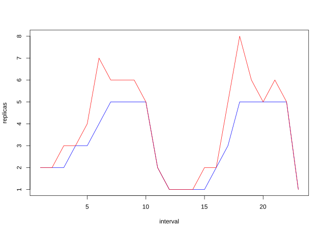

[](https://github.com/jthomperoo/predictive-horizontal-pod-autoscaler/actions)
[](https://codecov.io/gh/jthomperoo/predictive-horizontal-pod-autoscaler)
[](https://godoc.org/github.com/jthomperoo/predictive-horizontal-pod-autoscaler)
[](https://goreportcard.com/report/github.com/jthomperoo/predictive-horizontal-pod-autoscaler)
[](http://www.apache.org/licenses/LICENSE-2.0.html)
# Predictive Horizontal Pod Autoscaler
# Very early pre-release
This is a Custom Pod Autoscaler; aiming to have identical functionality to the Horizontal Pod Autoscaler, however with added predictive elements.  

This uses the [Horizontal Pod Autoscaler Custom Pod Autoscaler](https://www.github.com/jthomperoo/horizontal-pod-autoscaler) extensively to provide most functionality for the Horizontal Pod Autoscaler parts.  

This runs as a [Custom Pod Autoscaler](https://www.github.com/jthomperoo/custom-pod-autoscaler), which allows creation of custom autoscalers to run in a Kubernetes cluster; this project was made as an example of what is possible.

## How does it work?

This project works by calculating the number of replicas a resource should have, then storing these values and using statistical models against them to produce predictions for the future. These predictions are compared and can be used instead of the raw replica count calculated by the HPA logic.

## Usage

If you want to deploy this onto your cluster, you first need to install the [Custom Pod Autoscaler Operator](https://github.com/jthomperoo/custom-pod-autoscaler-operator), follow the [installation guide for instructions for installing the operator](https://github.com/jthomperoo/custom-pod-autoscaler-operator/blob/master/INSTALL.md).  

Once the Custom Pod Autoscaler Operator is installed, you can now use this project, see the `/example` folder for some samples.  

### Metrics
You can specify which metrics to scale on using the same YAML you would use for the Horizontal Pod Autoscaler; by putting it into the `metrics` option:
```yaml
- name: metrics
    value: |
    - type: Resource
      resource:
      name: cpu
      target:
        type: Utilization
        averageUtilization: 50
```
See the [Horizontal Pod Autoscaler Custom Pod Autoscaler](https://www.github.com/jthomperoo/horizontal-pod-autoscaler) for more information.

### Models
At the minute there is only two types of predictive model available; Linear Regression and Holt-Winters Time Series. There are plans to add in more useful and complex prediction models, such as ARIMA. You can specify the model to use in the `predictiveConfig` option in the deployment YAML.

#### Shared Configuration

All models share these three options:
- **type** - The type of the model, for example 'Linear' or 'HoltWinters'.
- **name** - The name of the model, must be unique and not shared by multiple models.
- **perInterval** - The frequency that the model is used to recalculate and store values - tied to the interval as a base unit, with a value of `1` resulting in the model being recalculated every interval, a value of `2` meaning recalculated every other interval, `3` waits for two intervals after every calculation and so on.

All models use `interval` as a base unit, so if the interval is defined as `10000` (10 seconds), the models will base their timings and calculations as multiples of this value.

#### Linear Regression
The YAML for a Linear Regression looks like this:
```yaml
- name: predictiveConfig
  value: |
  models:
  - type: Linear
    name: LinearPrediction
    perInterval: 1
    linear:
      lookAhead: 10000
      storedValues: 6
    decisionType: "maximum"
```
The **linear** component of the configuration handles configuration of the Linear regression options:
* **lookAhead** - sets up the model to try to predict `10 seconds` ahead of time (time in milliseconds).
* **storedValues** - sets up the model to store the past `6` evaluations and to use these for predictions. If there are `> 6` evaluations, the oldest will be removed.
For a more detailed example, [see the example in `/example/simple-linear`](example/simple-linear).

### Holt-Winters Time Series prediction
The YAML for a Holt-Winters time series prediction looks like this:
```yaml
- name: predictiveConfig
  value: |
    models:
    - type: HoltWinters
      name: HoltWintersPrediction
      perInterval: 1
      holtWinters:
        alpha: 0.9
        beta: 0.9
        gamma: 0.9
        seasonLength: 6
        storedSeasons: 4
    decisionType: "maximum"
```
The **holtWinters** component of the configuration handles configuration of the Linear regression options:
* **alpha**, **beta**, **gamma** - these are the smoothing coefficients for level, trend and seasonality respectively, requires tweaking and analysis to be able to optimise. See [here](https://github.com/jthomperoo/holtwinters) or [here](https://grisha.org/blog/2016/01/29/triple-exponential-smoothing-forecasting/) for more details.
* **seasonLength** - the length of a season in base unit intervals, for example if your interval was `10000` (10 seconds), and your repeated season was 60 seconds long, this value would be `6`.
* **storedSeasons** - the number of seasons to store, for example `4`, if there are `>4` seasons stored, the oldest season will be removed.

This is the model in action, taken from the `simple-holt-winters` example:  
  
The red value is the predicted values, the blue value is the actual values. From this you can see that the prediction is overestimating, but still pre-emptively scaling - storing more seasons and adjusting alpha, beta and gamma values would reduce the overestimation and produce more accurate results.  

For a more detailed example, [see the example in `/example/simple-holt-winters`](example/simple-holt-winters).


### Predictive Configuration

Beyond specifying models, other configuration options can be set in the `predictiveConfig` YAML:

- **decisionType** - decider on which evaluation to pick if there are multiple models provided, default `maximum`.
  * **maxmimum** - pick the highest evaluation of the models.
  * **minimum** - pick the lowest evaluation of the models.
  * **mean** - calculate the mean number of replicas between the models.
- **dbPath** - the path to store the SQLite3 database, default `/store/predictive-horizontal-pod-autoscaler.db`, e.g. for storing the DB in a volume to persist it.
- **migrationPath** - the path of the SQL migrations for the SQLite3 database, default `/app/sql`.

## Developing this project
### Environment
Developing this project requires these dependencies:

* `Go >= 1.13`
* `Golint`
* `Docker`

### Commands

* `make` - builds the Predictive HPA binary.
* `make docker` - builds the Predictive HPA image.
* `make lint` - lints the code.
* `make unittest` - runs the unit tests
* `make vendor` - generates a vendor folder.