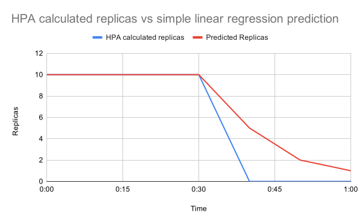

# Getting Started

This guide will walk through the first steps for deploying a simple Predictive Horizontal Pod Autoscaler (PHPA). This
guide will demonstrate how to deploy a PHPA that uses a linear regression to predict future load based on CPU usage.

To see the final result of this guide, check out the [Simple Linear Regression
example](https://github.com/jthomperoo/predictive-horizontal-pod-autoscaler/tree/master/examples/simple-linear).

## Prerequisites

This guide requires the following tools installed:

- [kubectl](https://kubernetes.io/docs/tasks/tools/#kubectl) == `v1`
- [helm](https://helm.sh/docs/intro/install/) == `v3`
- [k3d](https://k3d.io/#installation) == `v5`
- [jq](https://stedolan.github.io/jq/) >= `v1.6`

## Set up the cluster

This guide uses [k3d](https://k3d.io/) to handle provisioning a local K8s server, but you can use any K8s server (you
may already have one set up). If you already have a K8s server configured with the metrics server enabled, skip this
step and move on to the next step.

To provision a new cluster using k3d run the following command:

```bash
k3d cluster create phpa-test-cluster
```

## Install the Predictive Horizontal Pod Autoscaler Operator onto your cluster

Installing PHPAs requires you to have installed the PHPA operator first onto your cluster.

In this guide we are using `v0.13.2` of the PHPA operator, but check out the [installation
guide](./installation.md) for more up to date instructions for later releases.

Run the following commands to install the PHPA operator:

```bash
VERSION=v0.13.2
HELM_CHART=predictive-horizontal-pod-autoscaler-operator
helm install ${HELM_CHART} https://github.com/jthomperoo/predictive-horizontal-pod-autoscaler/releases/download/${VERSION}/predictive-horizontal-pod-autoscaler-${VERSION}.tgz
```

You can check the PHPA operator has been deployed properly by running:

```bash
helm status predictive-horizontal-pod-autoscaler-operator
```

You should get a response like this:

```bash
NAME: predictive-horizontal-pod-autoscaler-operator
LAST DEPLOYED: Thu Jul 21 20:29:06 2022
NAMESPACE: default
STATUS: deployed
REVISION: 1
TEST SUITE: None
NOTES:
Thanks for installing predictive-horizontal-pod-autoscaler.
```

If you get a response that says release not found then the install has not worked correctly.

## Create a deployment to autoscale

We now need to create a test application to scale up and down based on load. In this guide we are using an example
container provided by the Kubernetes docs for testing the Horizontal Pod Autoscaler; the test application will simply
respond `OK!` to any request sent to it. This will allow us to adjust how many requests we are sending to the
application to simulate greater and lesser load.

Create a new file called `deployment.yaml` and copy the following YAML into the file:

```yaml
apiVersion: apps/v1
kind: Deployment
metadata:
  labels:
    run: php-apache
  name: php-apache
spec:
  replicas: 1
  selector:
    matchLabels:
      run: php-apache
  template:
    metadata:
      labels:
        run: php-apache
    spec:
      containers:
      - image: k8s.gcr.io/hpa-example
        imagePullPolicy: Always
        name: php-apache
        ports:
        - containerPort: 80
          protocol: TCP
        resources:
          limits:
            cpu: 500m
          requests:
            cpu: 200m
      restartPolicy: Always
---
apiVersion: v1
kind: Service
metadata:
  name: php-apache
  namespace: default
spec:
  ports:
  - port: 80
    protocol: TCP
    targetPort: 80
  selector:
    run: php-apache
  sessionAffinity: None
  type: ClusterIP
```

This YAML sets up two K8s resources:

- A [Deployment](https://kubernetes.io/docs/concepts/workloads/controllers/deployment/) to provision some containers to
run our test application that we will scale up and down.
- A [Service](https://kubernetes.io/docs/concepts/services-networking/service/) to expose our test application so we
can send it HTTP requests to affect the CPU load.

Now deploy the application to the K8s cluster by running:

```bash
kubectl apply -f deployment.yaml
```

You can check the test application has been deployed by running:

```bash
kubectl get pods
```

## Create a linear regression autoscaler

Now we need to set up the autoscaler. This autoscaler will be configured to watch our test application's CPU usage and
apply a linear regression to predict ahead of time what the replica count should be.

```yaml
apiVersion: jamiethompson.me/v1alpha1
kind: PredictiveHorizontalPodAutoscaler
metadata:
  name: simple-linear
spec:
  scaleTargetRef:
    apiVersion: apps/v1
    kind: Deployment
    name: php-apache
  minReplicas: 1
  maxReplicas: 10
  behavior:
    scaleDown:
      stabilizationWindowSeconds: 0
  metrics:
    - type: Resource
      resource:
        name: cpu
        target:
          averageUtilization: 50
          type: Utilization
  models:
    - type: Linear
      name: simple-linear
      perSyncPeriod: 1
      linear:
        lookAhead: 10000
        historySize: 6
  decisionType: "maximum"
  syncPeriod: 10000
```

This autoscaler works by using the same logic that the Horizontal Pod Autoscaler uses to calculate the number of
replicas a target deployment should have, in this example it tries to make sure that the average CPU utilization is
`50%`. Once it calculates this Horizontal Pod Autoscaler target value, it then stores it and combines it with previous
calculations, feeding it into a linear regression model to try and fit a better prediction.

This example is not hugely practical, it serves primarily as a demonstration, as such it only stores the last 60 seconds
worth of replica target values and tries to fit this into a linear regression. You can see some sample results in
this graph:



This shows how as the calculated value drops rapidly from `10` target replicas to `0`, the linear regression results in
a smoothing effect on the actual scaling that takes place; instead it drops from `10` to `5` to `2` and finally to `1`.

The predictive elements are not only for scaling downwards, they could also predict ahead of time an increase in the
required number of replicas, for example with a sequence of increasing calculated replicas (`[1, 3, 5]`) it could
preemptively scale to `7` after applying a linear regression.

The key elements of the PHPA YAML defined above are:

- The autoscaler is targeting our test application; identifying it by the fact it is a `Deployment` with the name
`php-apache`:

```yaml
scaleTargetRef:
  apiVersion: apps/v1
  kind: Deployment
  name: php-apache
```

- The minimum and maximum replicas that the deployment can be autoscaled to are set to the range `0-10`:

```yaml
minReplicas: 1
maxReplicas: 10
```

- The frequency that the autoscaler calculates a new target replica value is set to 10 seconds (`10000 ms`).

```yaml
syncPeriod: 10000
```

- The *downscale stabilization* value for the autoscaler is set to `0`, meaning it will only use the latest autoscaling
target and will not pick the highest across a window of time.

```yaml
behavior:
  scaleDown:
    stabilizationWindowSeconds: 0
```

- A single *model* is configured as a linear regression model.
  - The linear regression is set to run every time the autoscaler is run (every sync period), in this example it is
    every 10 seconds (`perSyncPeriod: 1`).
  - The linear regression is predicting 10 seconds into the future (`lookAhead: 10000`).
  - The linear regression uses a maximum of `6` previous target values for predicting (`storedValues: 6`).

```yaml
models:
  - type: Linear
    name: simple-linear
    perSyncPeriod: 1
    linear:
      lookAhead: 10000
      historySize: 6
```

- The `decisionType` is set to be `maximum`, meaning that the target replicas will be set to whichever is higher
  between the calculated HPA value and the predicted model value.

```yaml
decisionType: "maximum"
```

- The *metrics* defines the normal Horizontal Pod Autoscaler rules to apply for autoscaling, the results of which
  will have the models applied to for prediction.
    - The metric targeted is the CPU resource of the deployment.
    - The targeted value is that CPU utilization across the test application's containers should be `50%`, if it goes
    too far above this there are not enough pods, and if it goes too far below this there are too many pods.

```yaml
metrics:
  - type: Resource
    resource:
      name: cpu
      target:
        averageUtilization: 50
        type: Utilization
```

Now deploy the autoscaler to the K8s cluster by running:

```bash
kubectl apply -f phpa.yaml
```

You can check the autoscaler has been deployed by running:

```bash
kubectl get phpa simple-linear
```

## Apply load and monitor the autoscaling process

You can monitor the autoscaling process by running:

```bash
kubectl logs -l name=predictive-horizontal-pod-autoscaler -f
```

This is looking at the operators logs, these are the brains of the autoscaling program and will report how all
autoscaling decisions are done.

You can see the targets calculated by the HPA logic before the linear regression has been applied to them by querying
the autoscaler's config map:

```bash
kubectl get configmap predictive-horizontal-pod-autoscaler-simple-linear-data -o=json | jq -r '.data.data | fromjson | .modelHistories["simple-linear"].replicaHistory[] | .time,.replicas'
```

This prints out all of the timestamped replica counts that the PHPA will use for its prediction.

You can increase the load by starting a new container, and looping to send a bunch of HTTP requests to our test
application:

```bash
kubectl run -it --rm load-generator --image=busybox /bin/sh
```

To start making requests from this container, run:

```bash
while true; do wget -q -O- http://php-apache.default.svc.cluster.local; done
```

You can stop this request loop by hitting *Ctrl+c*.

Try and start increasing the load, then stopping, you should be able to see a difference between the calculated HPA
values and the target values predicted by the linear regression.

## Delete the cluster and clean up

Once you have finished testing the autoscaler, you can clean up any K8s resources by running:

```bash
HELM_CHART=predictive-horizontal-pod-autoscaler-operator
kubectl delete -f deployment.yaml
kubectl delete -f phpa.yaml
helm uninstall ${HELM_CHART}
```

If you are using k3d you can clean up the entire cluster by running:

```bash
k3d cluster delete phpa-test-cluster
```

## Conclusion

This guide is intended to provide a simple walkthrough of how to install and use the PHPA, the concepts outlined here
can be used to deploy autoscalers with different predictive models. Check out the [examples in the project Git
repository to see more
samples](https://github.com/jthomperoo/predictive-horizontal-pod-autoscaler/tree/master/examples).
