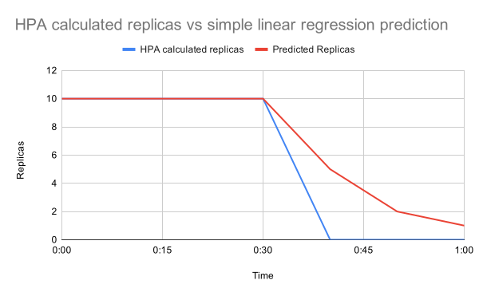

# Simple Linear Example

This example is showing a Predictive Horizontal Pod Autoscaler (PHPA) using a linear regression model.

## Requirements

To set up this example and follow the steps listed here you need:

- [kubectl](https://kubernetes.io/docs/tasks/tools/).
- A Kubernetes cluster that kubectl is configured to use - [k3d](https://github.com/rancher/k3d) is good for local
testing.
- [helm](https://helm.sh/docs/intro/install/) to install the PHPA operator.
- [jq](https://stedolan.github.io/jq/) to format some JSON output.

## Usage

If you want to deploy this onto your cluster, you first need to install the Predictive Horizontal Pod Autoscaler
Operator, follow the [installation guide for instructions for installing the
operator](https://predictive-horizontal-pod-autoscaler.readthedocs.io/en/latest/user-guide/installation).

This example was based on the [Horizontal Pod Autoscaler Walkthrough](https://kubernetes.io/docs/tasks/run-application/horizontal-pod-autoscale-walkthrough/).

1. Run this command to spin up the app/deployment to manage, called `php-apache`:

```bash
kubectl apply -f deployment.yaml
```

2. Run this command to start the autoscaler, pointing at the previously created deployment:

```bash
kubectl apply -f phpa.yaml
```

3. Run this command to see the autoscaler working and the log output it produces:

```bash
kubectl logs -l name=predictive-horizontal-pod-autoscaler -f
```

4. Run this command to increase the load:

```bash
kubectl run -i --tty load-generator --rm --image=busybox --restart=Never -- /bin/sh -c "while sleep 0.01; do wget -q -O- http://php-apache; done"
```

5. Watch as the number of replicas increases.
6. Run this command to see the replica history for the autoscaler stored in a configmap and tracked by the autoscaler:

```bash
kubectl get configmap predictive-horizontal-pod-autoscaler-simple-linear-data -o=json | jq -r '.data.data | fromjson | .modelHistories["simple-linear"].replicaHistory[] | .time,.replicas'
```

As the load is increased the replica count will increase as the PHPA detects average CPU utilization of the pods has
gone above 50%, so will provision more pods to try and bring this value down. As the replica count changes the PHPA
will store the history of replica changes that have been made, and will feed this data into the linear regression model
every time the autoscaler runs too. This results in two values, the raw replica count calculated at the instant the
autoscaler has run, and a predicted value that the model has calculated based on the replica count history. The resource
will then be scaled to the greater of these two values (though there are other options than picking the maximum, see
the [decisionType configuration option for more
details](https://predictive-horizontal-pod-autoscaler.readthedocs.io/en/latest/reference/configuration/#decisiontype)).

An example of how this predictive scaling looks is this graph:



This shows the replica count decreasing, with the raw calculated replica counts and predicted replica counts compared.
As the raw calculated replica count drops of drastically the linear regression takes a smoother scale down approach
based on calculated history.

## Explained

This example uses the following YAML to define the autoscaler:

```yaml
apiVersion: jamiethompson.me/v1alpha1
kind: PredictiveHorizontalPodAutoscaler
metadata:
  name: simple-linear
spec:
  scaleTargetRef:
    apiVersion: apps/v1
    kind: Deployment
    name: php-apache
  minReplicas: 1
  maxReplicas: 10
  behavior:
    scaleDown:
      stabilizationWindowSeconds: 0
  metrics:
    - type: Resource
      resource:
        name: cpu
        target:
          averageUtilization: 50
          type: Utilization
  models:
    - type: Linear
      name: simple-linear
      linear:
        lookAhead: 10000
        historySize: 6
```

- `scaleTargetRef` is the resource the autoscaler is targeting for scaling.
- `minReplicas` and `maxReplicas` are the minimum and maximum number of replicas the autoscaler can scale the resource
between.
- `syncPeriod` is how frequently this autoscaler will run in milliseconds, so this autoscaler will run every 10000
milliseconds (10 seconds).
- `behavior.scaleDown.stabilizationWindowSeconds` handles how quickly an autoscaler can scale down, ensuring that it
will pick the highest evaluation that has occurred within the last time period described, by default it will pick the
highest evaluation over the past 5 minutes. To stop this from happening we have set the downscale stablilization to
`0` to disable it.
- `metrics` defines the metrics that the PHPA should use to scale with, in this example it will try to keep average
CPU utilization at 50% per pod.
- `models` contains the statistical models we're applying to the resulting replica count, this this example it's just
a linear regression model that stores the past 6 replica counts (`historySize: 6`) and uses that to predict what the
replica count will be 10000 milliseconds (10 seconds) in the future (`lookAhead: 10000`).
